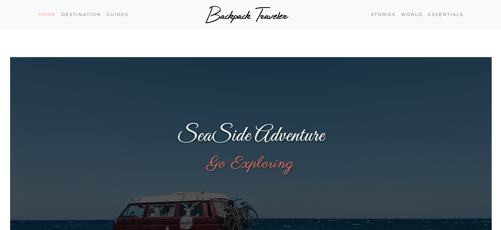

# 🧳 Backpack Traveler

**Tags:** Travel Website • Responsive Design • Bootstrap 5 • Frontend Project

A modern and responsive travel website designed for adventure lovers. Showcasing beautiful destinations, trip packages, and travel blogs with a clean and minimal design.

---

## 🔗 Live Demo
[View Live] (https://mahir9104.github.io/Backpack-Traveler/)

---

## 🧩 Features
- Fully responsive travel-themed design built with **Bootstrap 5**
- Elegant homepage with hero banner and destination highlights
- Clean, photo-focused layout for travel inspiration
- Interactive cards and hover effects for destinations
- Organized sections **(Home, destination, guides, stories, world, essentials, footer)**
- Smooth navigation with easy section transitions
- Modern typography and lightweight performance
- Ideal for travel blogs, tour agencies, or adventure showcases

---

## 🛠️ Technologies Used
- **HTML5**
- **CSS3**
- **Bootstrap 5**

---

## 📸 Preview

---

## 📂 Folder Structure 

Backpack-Traveler/ 
├─ index.html
├─ style.css 
├─ images/ 
└─ README.md 

--- 

## 👤 Author 

**Mahir panchal** 
- Frontend Developer | Full-Stack Web Development Learner 
- [GitHub](https://github.com/mahir9104) | [LinkedIn](https://www.linkedin.com/in/mahir-panchal-052232331/)
